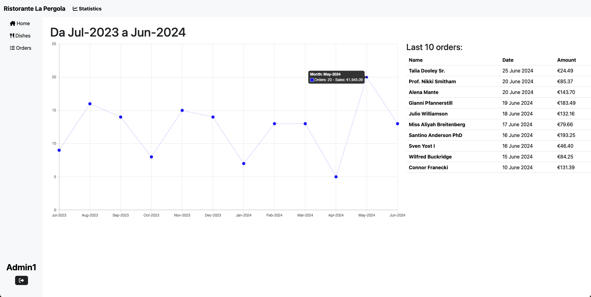
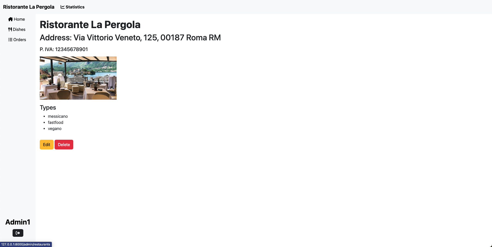
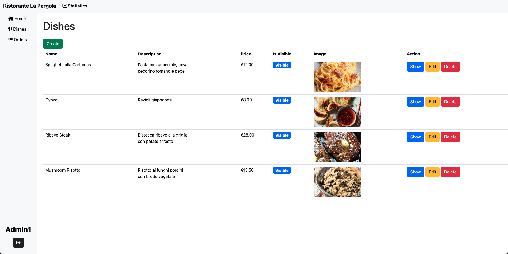
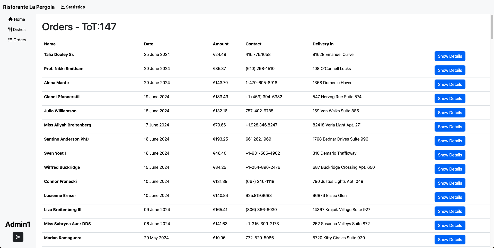
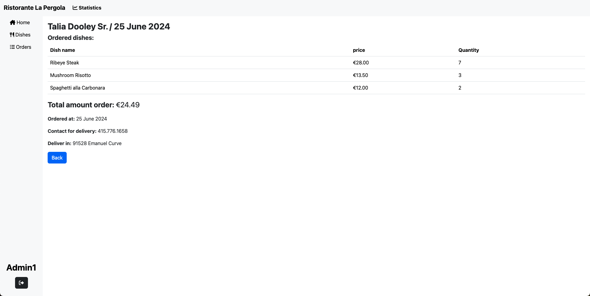

Progetto finale Deliveboo

Dashboard per ristoratori

Creazione di una dashboard per ristoratori con la possibilità di creare il proprio ristorante,aggiungere, eliminare e modificare i propri piatti e tenere lo storico degli ordini dei clienti.

Questo repository è la parte di backoffice di un progetto che comprende anche il front-end:

https://github.com/AlessiaCiabatti/Deliveboo-Frontend.git

